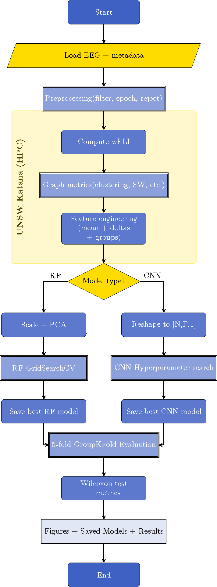

# Sedation State Prediction using EEG Graph-Theoretical Features

Machine-learning pipeline for predicting sedation states (responsiveness in earlier versions) during propofol sedation based on EEG-derived graph-theoretical measures (e.g., small-worldness, clustering, mean degree).

## Overview

This project explores how network topology metrics extracted from EEG connectivity (dwPLI) relate to consciousness under propofol sedation. By leveraging graph-theoretical measures, we train machine-learning models to infer sedation states beyond descriptive analysis.
This project reuses the open-access EEG dataset from [Chennu (2016)](https://doi.org/10.1371/journal.pcbi.1004669) and extends their graph-theoretical analysis of sedation-related connectivity changes using additional machine learning approaches.

## Data

The dataset originates from [Chennu et al. (2016)](https://doi.org/10.1371/journal.pcbi.1004669), an open-access EEG study on propofol-induced changes in functional connectivity.  
Raw EEG data are available through the PLOS repository and are **not redistributed here** in compliance with data-sharing policies.

Derived features (dwPLI matrices, graph metrics) are generated via scripts in `src/connectivity.py` and `src/graph_metrics`.

## Methods

1Methods Overview
Feature Extraction

EEG epochs were processed to compute connectivity using the debiased weighted Phase Lag Index (dwPLI) across five canonical frequency bands (δ = 1–4 Hz, θ = 4–8 Hz, α = 8–13 Hz, β = 13–30 Hz, γ = 30–45 Hz).
For each subject × sedation level × band, the following graph-theoretical features were extracted from the weighted connectivity matrices:

| Metric | Description |
|---------|-------------|
| **mean_degree** | Average node degree (mean connection strength). |
| **clustering** | Weighted clustering coefficient (local interconnectedness). |
| **path_length** | Mean shortest path between all node pairs (integration). |
| **global_efficiency** | Inverse of average shortest path (global integration). |
| **local_efficiency** | Efficiency within neighborhoods (segregation). |
| **modularity (Q)** | Strength of community structure (Louvain algorithm). |
| **participation_coefficient** | Extent of cross-module connectivity. |
| **small_worldness** | Ratio of normalized clustering to normalized path length vs. random graphs. |

Cross-band ratio computation
For each subject and sedation level, ratios were calculated between EEG bands (θ/α, θ/β, α/β, δ/α) for every feature, e.g.:
mean_degree_theta_alpha_ratio, clustering_alpha_beta_ratio, etc.
→ Captures spectral redistribution of network topology across frequency bands.

Within-subject Δ-normalization
After computing ratios, all features (ratios and absolute metrics) were normalized per subject and per band relative to the subject’s baseline state:

$\delta f = \frac{(f_{level} − f_{baseline})} / f_{baseline}$

→ Removes inter-individual scale differences, isolating condition-specific changes.

Normalization and Data Curation

Δ-normalized features were concatenated with their baseline-independent ratio features.

The “Recovery” state (SedationLevel = 4) was excluded due to its transitional nature.

Final dataset: per-subject × sedation-level entries containing both normalized graph metrics and cross-band ratios.

| Step | Description |
|------|--------------|
| **Target variable** | `SedationLevel` (1 = Baseline, 2 = Mild, 3 = Moderate) |
| **Split strategy** | `GroupShuffleSplit` ensuring subjects are disjoint across train/test |
| **Feature set** | Ratio features (`*_ratio`) + Δ-normalized metrics |
| **Preprocessing** | Standard scaling and PCA (retain 95 % variance) |
| **Model** | RandomForestClassifier (PCA → RF pipeline) |
| **Hyperparameter tuning** | Group-aware GridSearchCV over `n_estimators`, `max_depth`, `max_features`, and `min_samples_leaf` |
| **Best parameters** | `max_depth = 3`, `max_features = 0.4`, `min_samples_leaf = 5`, `n_estimators = 200` |
| **Performance** | Group-CV accuracy ≈ 0.65 (chance ≈ 0.33) |

  

## Citation

This repository builds upon the dataset and framework described in:

> Chennu S, O’Connor S, Adapa R, Menon DK, Bekinschtein TA (2016) Brain Connectivity Dissociates Responsiveness from Drug Exposure during Propofol-Induced Transitions of Consciousness. PLoS Comput Biol 12(1): e1004669. https://doi.org/10.1371/journal.pcbi.1004669

If you use this repository, please cite the original study above and this repository as:

> Schätzle, H. (2025). *Sedation State Prediction using EEG Graph-Theoretical Features* [GitHub repository].  
https://github.com/05d762de69/sedation-state-prediction

## License

This repository is distributed under the MIT License.  
See `LICENSE` for details.

## Contact

For questions or collaboration:
**Hannes Schätzle**  
Erasmus University Rotterdam / UNSW Sydney  
📧 h.schaetzle@student.eur.nl